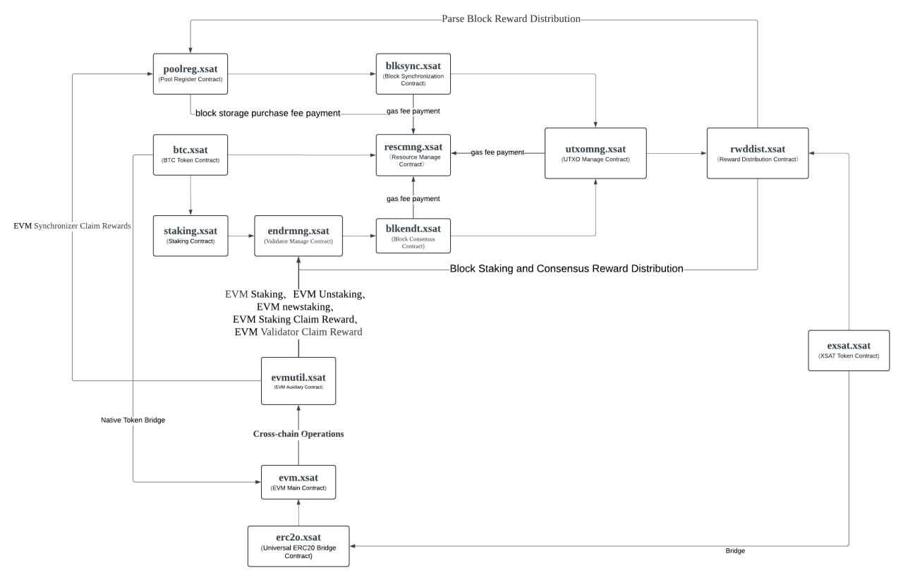

# contract-of-consensus

## Contracts

| name                                                  | description                    | docs                                                              |
| ----------------------------------------------------- | ------------------------------ | ----------------------------------------------------------------- |
| [btc.xsat](https://bloks.io/account/btc.xsat)         | BTC Token Contract             |                                                                   |
| [xsat.xsat](https://bloks.io/account/xsat.xsat)       | XSAT Contract                  |                                                                   |
| [poolreg.xsat](https://bloks.io/account/poolreg.xsat) | Pool Register Contract         | [poolreg.xsat document](./contracts/poolreg.xsat/poolreg.xsat.md) |
| [rescmng.xsat](https://bloks.io/account/rescmng.xsat) | Resource Manage Contract       | [rescmng.xsat document](./contracts/rescmng.xsat/rescmng.xsat.md) |
| [utxomng.xsat](https://bloks.io/account/utxomng.xsat) | UTXO Manage Contract           | [utxomng.xsat document](./contracts/utxomng.xsat/utxomng.xsat.md) |
| [rwddist.xsat](https://bloks.io/account/rwddist.xsat) | Reward Distribution Contract   | [rwddist.xsat document](./contracts/rwddist.xsat/rwddist.xsat.md) |
| [blkendt.xsat](https://bloks.io/account/blkendt.xsat) | Block Consensus Contract       | [blkendt.xsat document](./contracts/blkendt.xsat/blkendt.xsat.md) |
| [blksync.xsat](https://bloks.io/account/blksync.xsat) | Block Synchronization Contract | [blksync.xsat document](./contracts/blksync.xsat/blksync.xsat.md) |
| [endrmng.xsat](https://bloks.io/account/endrmng.xsat) | Validator Manage Contract      | [endrmng.xsat document](./contracts/endrmng.xsat/endrmng.xsat.md) |
| [staking.xsat](https://bloks.io/account/staking.xsat) | Staking Contract               | [staking.xsat document](./contracts/staking.xsat/staking.xsat.md) |

## Contract Architecture

exSat a scaling solution to the critical challenges of trust, functionality, scalability, utility and interoperability faced by the Bitcoin ecosystem. This novel Docking Layer solution, as a first-of-its-kind, aims to build trust by extending the data consensus of the Bitcoin ecosystem with a hybrid consensus mechanism; to achieve functionality by bridging the gap of smart contracts; to enhance utility by unifying BTC across diverse blockchain ecosystems; and to drive multichain interoperability by intent-centric omnichain DApps.

exSat introduces several key innovations to realize its vision including:

Data Consensus + BTC Staking to Extend Trust of BTC: Extends Bitcoin's data consensus through a Hybrid Consensus Mechanism, combining Proof of Work (PoW) and Proof of Stake (PoS).

Decentralized State Data Indexing for Easy On-chain Operation: Critical for smart contracts to operate easily, and the support of diverse assets through multi-indexing capabilities including BTC, Ordinals, Runes and more potential protocols.

Scaling Bitcoin Ecosystem with Smart Contract Platform: Extends full support for Ethereum Virtual Machine-based (EVM) application development, enabling a broader range of decentralized application (DApp) functionalities, further bridging the capabilities between Bitcoin and advanced smart contract platforms.

The Modular Scaling Solution for the Bitcoin Ecosystem: exSat empowers developers to enhance the scalability of the Bitcoin ecosystem efficiently and securely, leveraging the robust trust and security of exSat. It simplifies the creation of customizable BTC Layer 2 (L2) solutions incorporating Zero-Knowledge (ZK) rollups, or side chains using the latest implementation of the Antelope protocol, facilitating easy, quick, and seamless development

exSat forges a trustworthy and secure pathway to enhance Bitcoin's scalability and enable smart contract capabilities, unlocking additional utility value for BTC beyond its role as a store of value. In the long run, exSat aims to streamline the process of deploying a Bitcoin scaling solution, making it as straightforward as deploying a contract on-chain. This pioneering effort will pave the way for a flourishing Bitcoin ecosystem and drive mass adoption of blockchain technology.

Through exSat's innovative approach, users and developers from diverse backgrounds will experience the convenience of intent-centric operations and unified liquidity. By abstracting away complexities, exSat empowers a broader audience to leverage the power of Bitcoin and its L2 solutions seamlessly, fostering a more inclusive and accessible blockchain landscape.

Embracing a modular and extensible architecture, exSat's trustworthy and secure solution lays the foundation for a vibrant ecosystem built upon Bitcoin's robust security model. As the adoption of blockchain technology continues to accelerate, exSat's vision positions Bitcoin at the forefront of this revolution, enabling a vast array of DApps and services to thrive within its decentralized and transparent framework.
